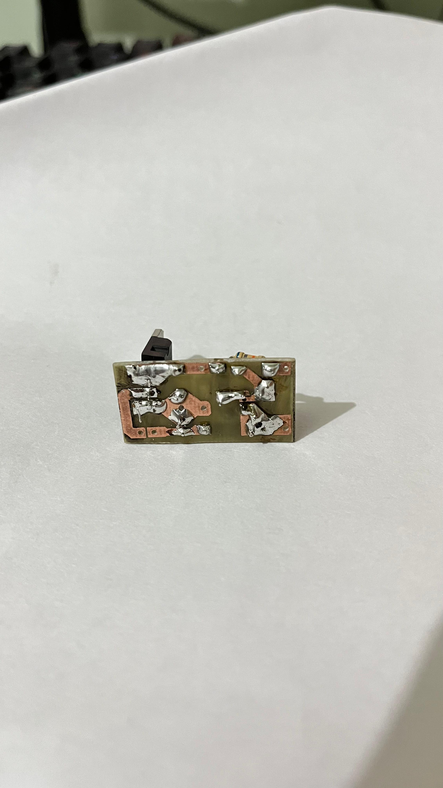
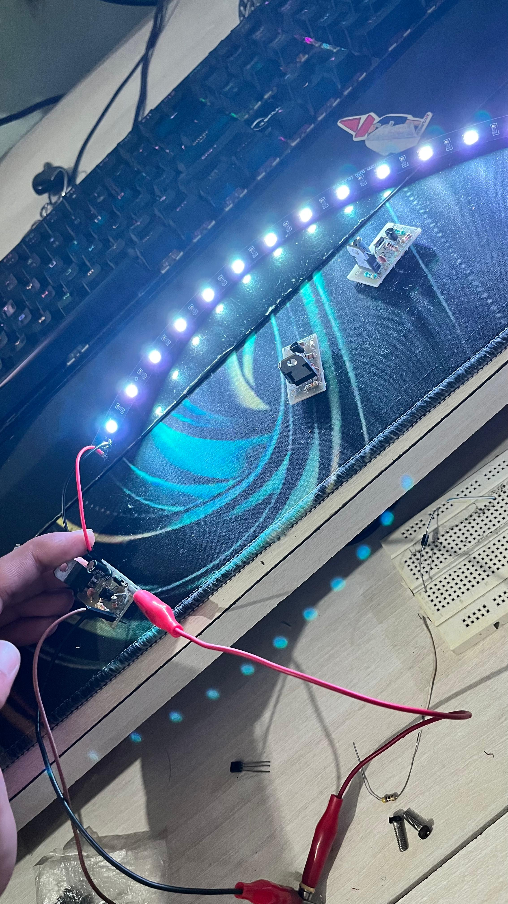
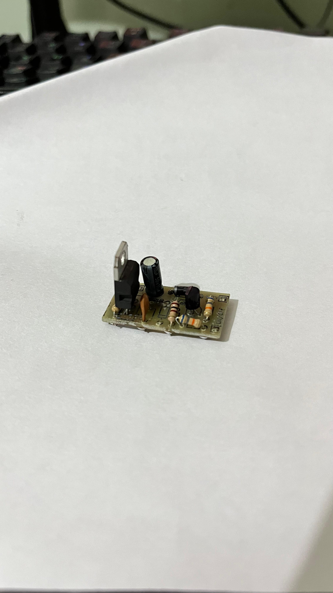
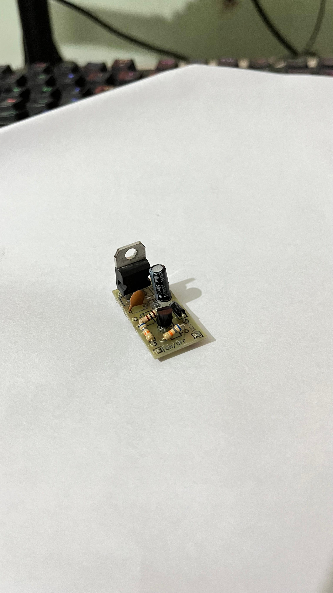
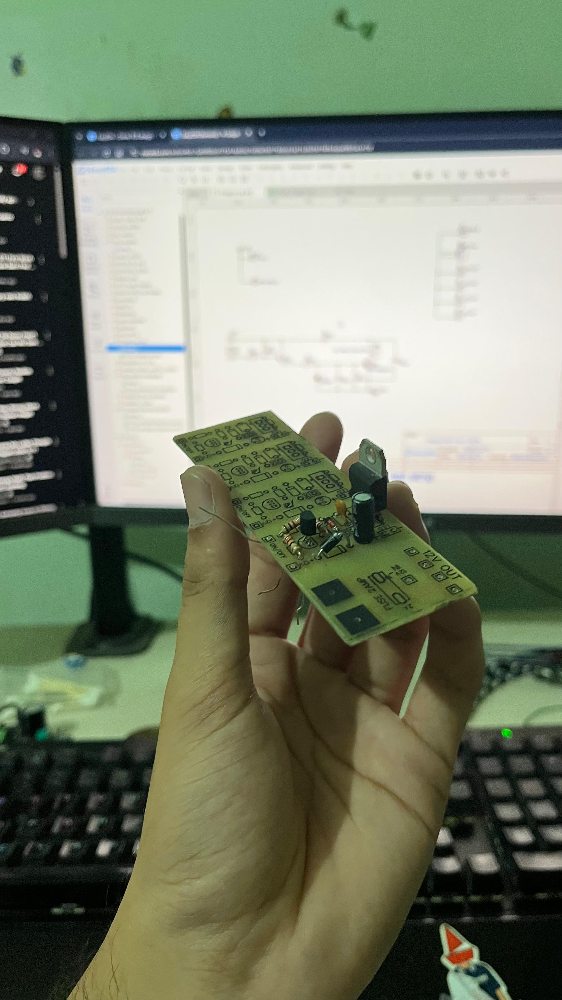
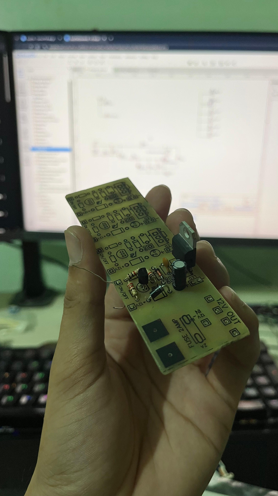
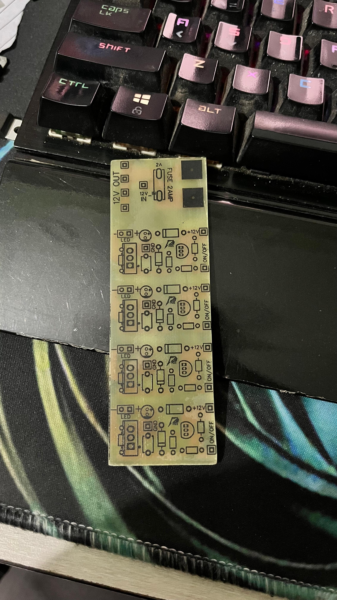
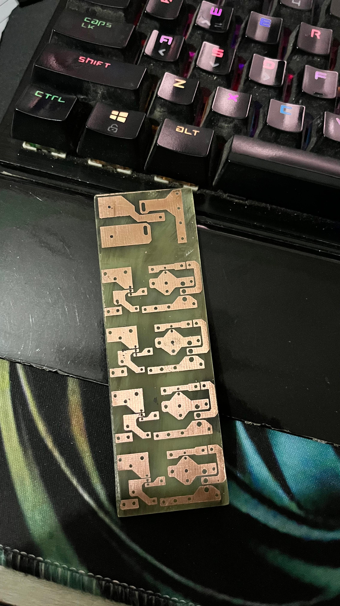

# Door Light Controller for Car

## Overview
This project is an independent door light controller designed for automotive use. It automatically turns on a white LED strip when the car door is opened and turns it off when the door is closed. The controller is built using a simple circuit with 10 components per door, ensuring reliable operation and safety.

## Features
- **Automatic ON/OFF:** The LED strip lights up when the door is open and turns off when closed.
- **Safety Measures:** Includes a 2A Fuse for overcurrent protection and a DC button for manual control.
- **Simple Design:** Only 10 components required per door.
- **LED Strip:** Uses a 12V 5050 18LED RGB strip (configured for white light).

## How It Works
1. **ON/OFF Pin Control:**
	- The ON/OFF pin is connected to a button mounted on the car frame.
	- When the door is closed, the button is pressed, pulling the ON/OFF pin high to 12V.
	- When the door is open, the button is released, and the ON/OFF pin is pulled low (to GND).
	- This change in voltage triggers the LED strip to turn on or off.

2. **Circuit Operation:**
	- The LED strip is powered by 12V and controlled by an N-channel MOSFET (STP190N55LF3).
	- The gate of the MOSFET is driven by a PNP transistor (BC557), which acts as a switch based on the ON/OFF pin state.
	- Resistors and capacitors are used for signal conditioning and noise filtering.
	- A diode (1N4007) provides reverse polarity protection.

3. **Component List (per door):**
	- 1 × 12V 5050 18LED RGB LED strip (white)
	- 1 × STP190N55LF3 N-channel MOSFET
	- 1 × BC557 PNP transistor
	- 2 × 68kΩ resistors
	- 2 × 1kΩ resistors
	- 1 × 0.01μF capacitor
	- 1 × 100μF capacitor
	- 1 × 1N4007 diode (2A)
	- 1 × 1N5242B Zener diode
	- 1 × DC button (door switch)

## Schematic
See `Schematics.pdf` and the image above for the detailed circuit diagram.

## Installation
1. Mount the LED strip on the desired door location.
2. Connect the ON/OFF pin to the door button (switch).
3. Wire the circuit as shown in the schematic, ensuring correct polarity and component placement.
4. Connect the circuit to the car's 12V supply and ground.

## Safety Notes
- The 2A fuse protects against accidental overcurrent and reverse polarity.
- Ensure all connections are secure and insulated to prevent shorts.
- Test the circuit with the door open and closed to verify correct operation before final installation.

## Media
- Example images:
	- 
	- 
	- 
	- 
	- 
	- 
	- 
	- 
- Example videos: See included `.mp4` files for demonstration.
